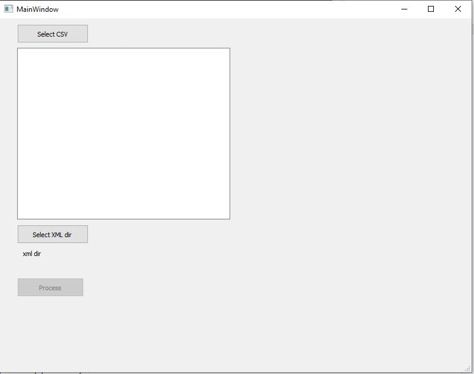
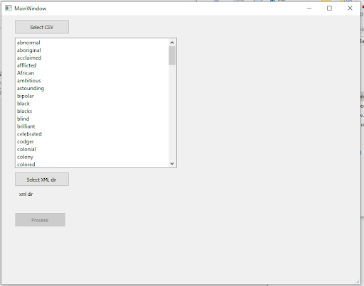
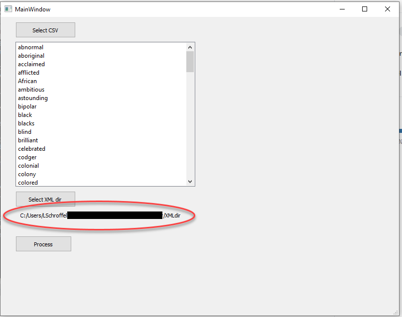
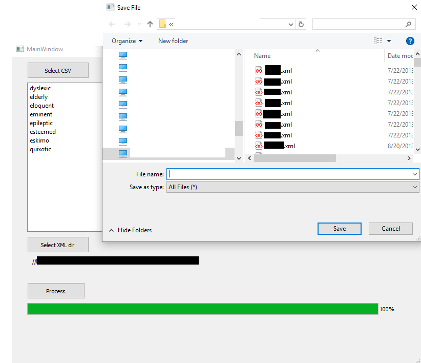

# XMLTermDetective  

Find and count terms from a csv list across a directory of xml files. A method for identifying racist terminology in ead finding aids.

## Feature summary  
TermDetective is a free software designed to:
- **Find terms in context in xml files**  
- **Count terms**  
- **Report**  

## Prerequisites  
- Python version 3.7  
- PyQt5: python -m pip install PyQt5  
- Windows 10
- Git (for easy git install)

## Usage  
With Python3 and PyQt5 installed (see above) the script can be run with the following command::  
`python XMLTermDetective.py`

## Usage detail  
### To download with Git
Open command line and navigate to a local directory of choice. Type
`git clone https://github.com/jerkmuffin/XML-Term-Detective.git`

Navigate to the TermDetective folder and launch the application using the python (.py)  file, see above. A GUI will open:  

Select a csv file with the list of terms to be analyzed by clicking the “Select CSV” button. The csv list can run as a column or row (see examples). When generating a csv to be uploaded consider the pluralization of words, for example, the term “cat” will produce results for “cat” and “cats” whereas “mice” and “mouse” would need to be evaluated separately.  
After selecting the csv file the list of terms should appear in the window.  

After the terms have loaded select the directory of xml files by clicking on the “Select XML dir” and browsing to the appropriate folder. You should see the file path load in the GUI.  

To generate the reports select “Process”. When the process has completed the process bar will have filled to 100% and a prompt to “Save File” will appear. Choose a name for the files and you will generate two csv reports: [name].count.csv and [name].output.csv.  

The output file will have the following columns: “File”, “Word”, “Line Number”, “Line Text”. The “File” column represents the name of the xml file being evaluated. The “Word” column is the term taken from the uploaded csv term list. The “Line Number” is the xml line number. The “Line text” is the line of text excerpted from the xml to see the term in context.  

The count file will have a column for “File” and a column for every term that was included in the uploaded terms csv. The file column represents the name of the xml file being evaluated. Each file will have a number result for each term. If there are no results it will return the number 0.
